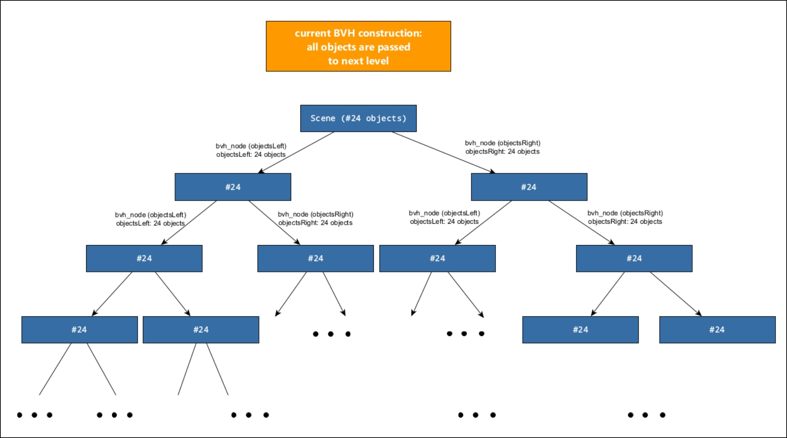
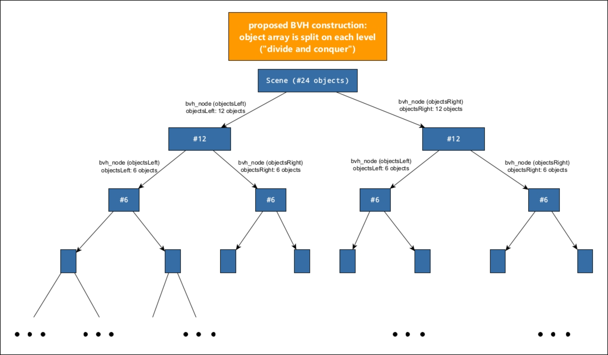

# BVH Improvements

Original: [Faster and simpler BVH construction](https://github.com/RayTracing/raytracing.github.io/issues/1388)

There was a pretty severe bottleneck in the code. The BVH construction of numerous objects on a Scene, like more than 20k spheres, or the Stanford dragon test model (triangle mesh that has roughly 900k triangles) takes a lot of time, so it's impossible to even start rendering any pixels.

On every recursion step of the BVH construction, we make a copy of the entire vector of hittable pointers, even though we only need to process a handful of objects of those in the actual recursion step. So the pointers for all 900k triangles are copied in every split, which led to the BVH construction taking forever.

There is a way of optimizing the current code with a few lines of code while making it easier to understand for beginners as well. And we gain not only a giant speed-up for potentially large amounts of hittable objects, but also it might be a bit more intuitive as well.

The proposed change also eliminates the tracking of the start and end indices and divides the input array before each recursion level. This means that only the needed objects are passed to the next level. In a true «divide and conquer» fashion. This avoids copying data that is not needed, the array gets smaller and smaller on each level, and the speed-up is huge.

As an example, let's say you have 24 objects in your scene. In the current code, all 24 objects get passed down in every step down to the leaf construction level:



In the proposed new code, we would process 24, then split the array, then process 2x12, split, then process 4x6, split, process 8x3 etc.



This is also literally more true to what the BVH is - a space partitioning function - not indexing into an array function. (It would be different if we were indexing into the array for speed purposes, but we are not doing this here anyway, as we are copying the vector over and over).

Of course, this is not noticeable with small object counts, but for large numbers, this change is huge.

Here is the proposed bvh_node function along with some comments:

```cpp
// it is no longer necessary to pass indices as arguments
// because in each recursion step, we are processing the entire given src_objects vector.
bvh_node(const std::vector<shared_ptr<hittable>>& src_objects) {
    auto objects = src_objects; // Create a modifiable array of the source scene objects

    int axis = random_int(0,2);
    auto comparator = (axis == 0) ? box_x_compare : (axis == 1) ? box_y_compare : box_z_compare;

    // how many objects are in the given array?
    size_t size = objects.size ();

    if (size == 1) {
        left = right = objects[0];
    } else if (size == 2) {
        if (comparator(objects[0], objects[1])) {
            left = objects[0];
            right = objects[1];
        } else {
            left = objects[1];
            right = objects[0];
        }
    } else {
        std::sort(objects.begin(), objects.end(), comparator);

        // where do we need to split?
        auto mid = size/2;

        // true "divide and conquer" method: split objects vector into two new vectors
        // left:    0 --> mid - 1
        // right: mid --> end

        auto objectsLeft = std::vector<std::shared_ptr<hittable>>(objects.begin(), objects.begin()+mid);
        auto objectsRight = std::vector<std::shared_ptr<hittable>>(objects.begin()+mid, objects.end());

        // only pass the necessary objects into next recursion step,
        // with each step, the objects vector is getting smaller and therefore faster to process
        left = make_shared<bvh_node>(objectsLeft);
        right = make_shared<bvh_node>(objectsRight);
    }
}
```

The function call is simplified and does not need `size_t start` and `size_t end` arguments any more. We just hand over the array of objects and let it do its thing:

```cpp
bvh_node(const std::vector<shared_ptr<hittable>>& src_objects)
```

We are still copying the input array but since it is getting halved in each recursion level, it is not too big of a deal any more:

```cpp
auto objects = src_objects; // Create a modifiable array of the source scene objects
```

We can eliminate `object_span` as well because we are dealing with the whole array. So it just becomes `size`:

```cpp
size_t size = objects.size ();
```

We don't need `start` and `end` indices any more to read from the array…

```cpp
left = objects[1];
right = objects[0];
```

…and splitting the array for the next recursion into `objectsLeft` and `objectsRight` is super easy, thanks to the `.begin()` and `.end()` iterators:

```cpp
auto objectsLeft = std::vector<std::shared_ptr<hittable>>(objects.begin(), objects.begin()+mid);
auto objectsRight = std::vector<std::shared_ptr<hittable>>(objects.begin()+mid, objects.end());
```

Now this is the critical part, we don't call the `bvh_node()` function again with the whole objects array as it is done currently…

```cpp
left = make_shared<bvh_node>(objects, start, mid);
right = make_shared<bvh_node>(objects, mid, end);
```

… but instead, each recursion call is only with half of the original objects (`objectsLeft` and `objectsRight`):

```cpp
left = make_shared<bvh_node>(objectsLeft);
right = make_shared<bvh_node>(objectsRight);
```

In the next recursion level we will then operate on the full `objectsLeft` and `objectsRight`, split each of them in half, … and so on.

Also, there is an algorithm `std::nth_element` which could significantly improve the performance. I've played a bit with your implementations, even slightly more. In C++ 17 we also have parallel versions of algorithms in question, so I've tried to enable it as well.

The ray-tracing framework is still more or less usable for the 500'000 spheres in the box, using your both, `std::sort` «divide and conquer» and `std::nth_element` «divide and conquer», implementations.

The rough (in seconds) BVH construction time for 500'000 spheres on my machine is:

```txt
... old version of the application can't start in reasonable time.
std::sort "divide and conquer" = 5s
std::sort "divide and conquer" parallel = 5s
std::nth_element "divide and conquer" = 3s
std::nth_element "divide and conquer" parallel = 3s
std::ranges::nth_element non-parallel "divide and conquer" from ranges = 4s (from C++20)
```

Parallel or non-parallel algorithms seem doesn't add any improvements.
